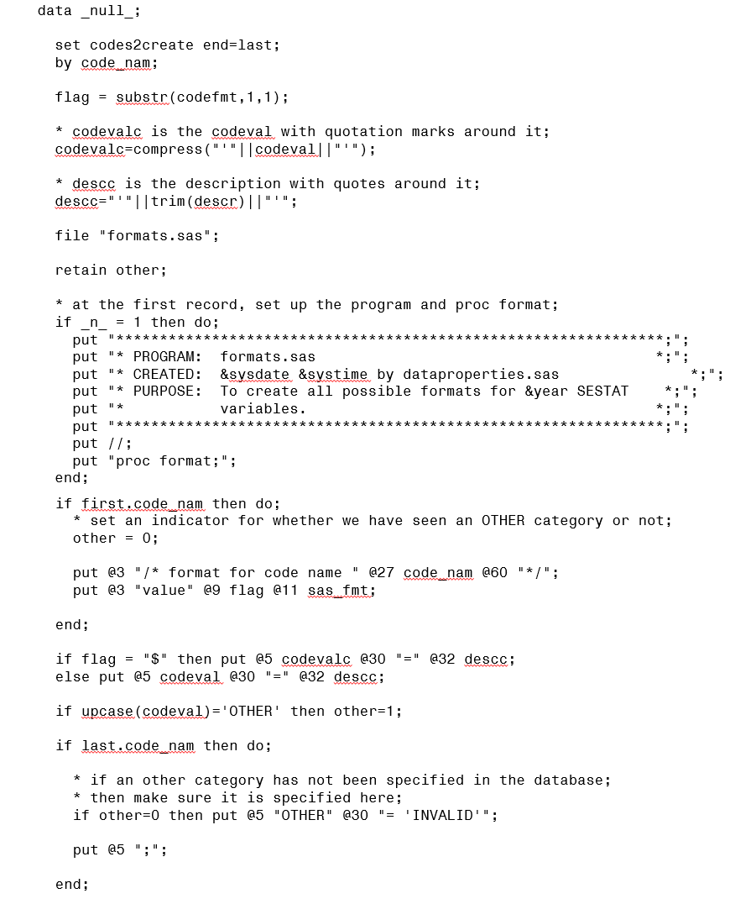

# SAS_Data_Null_Tricks
How to tailor SAS output and make SAS do more work so you can look smarter

## Motivation
For years I have played around with the SAS data step funcitonality using data _null_.  Here we are not creating a data set but we have all of the data step functionality available to us.  These are some powerful tools that you can use to accomplish more by letting SAS do the work for you.

## Some things you can do with data _null_
* Put notes into your print file
* Track program progress in yourprint file
* Create counts and specialized output
* Create and sent email (Unfortunately this is not as easy as it used to be)
* Create include files, SAS statements and other SAS programs

# Leaving notes for yourself
### (See test.sas)
Finding your place in a log or even lst file can be difficult. This is especially true of macro driven programs and programs that rely heavily on include files. Dropping notes in the output file is a good way to keep track of where in teh program you are (and delude yourself into thinking SAS loves you back).

A little more useful is simply dropping start and stop notes in your lst file that tell you when a critical section started and stopped.  Take this following example:

Note that because of the “count ne 0”, the second data _null_ will only print if there are errors found in the data. However, the lst file will look the same whether there are no errors or the program failed to reach the point of printing.
The start-printing line lets you know the program made it to the point of running the checks and preparing to print.
The end-printing line lets you know that it made it past the printing. 

**NOTE** This is not an excuse for not checking the log file… just an added check and a way to find your place in more complex SAS code.

What does it look like?

# Printing key observation counts
Consider the following example.

What do the results look like?

You can create nice-looking text printouts that can easily be copied into emails or documents.  In this example, I used a data step just to create the counts.  In practice, I would create these counts in a data step that was functional in the program.  This would add minimal processing time but utilize the power of the data step that I was already in.  For large datasets this is also more efficient than using proc freq after the data step.  Also, this technique allows for overlapping ranges when that is of analytical use.

## You can email with SAS!
### (See test_email.sas)
Actually, this is not as easy as it used to be... Most IT departments will block this from happening.  But it was fun while it lasted.  I used to insert the following code at the end of some of my longer-running programs:

And the following would show up in my inbox:

But security being what it is now... that loophole is closed and I just have to pay attention to my runs. 

## Using SAS code to write SAS code
### (See dataproperties.sas, logic_checks.sas)
We have a database containing metadata information for a series of surveys.  We used this database to manage 3 - 4 surveys all with similar structure but different questions and response options.  The database tells us which questions (and hence which variables) are present, what values those variables can take, the meaning of those values, etc.  

From that information we created a series of programs--
* formats.sas to hold all SAS proc format statements
* apply_formats_survey.sas to hold statemetns applying the correct format to each variable in a particular survey
* logic_checks.sas to hold a series of skip-logic checks fore each survey. This used both the metadata and a logic-checking spreadsheet.

The beauty of SAS code is that it is just plain text.  And plain text is easy to write with a file statement in SAS.

Take the following code for example:

And now look at the code that was created:

## Using SAS code to write to a post-script file and eventually create a PDF
### (See rfd_prep.sas and rfd_create.sas)
These programs use the same database referenced above to create detailed data specificatons for each of three surveys.  
* The program rfd_prep.sas reads from the Access database, reformats variables, and creates all other information needed to create the codebooks. 
* The program rfd_create.sas uses these datasets to create a PDF file containing variable descriptions, possible values, and value descriptions. 
* The post-script files can be run through an interpreter (Adobe or even Google cloud convert) to be converted into PDF format.
* The main point here is that we are using data step processing to create text files.  Because we named this as ".ps", it will be interpreted as a post-script file.  
* I also used a good bit of macro variable population/tracking and note-dropping to help keep track of where I was in the program and make my output as useful as possible.
* Both of these programs are rather longer and more complex than the previous examples. For this reason, I didn't paste screenshots here. See the internal comments for more details.  It tried to be very explicit within the program so it would be easier to adapt to other tasks.